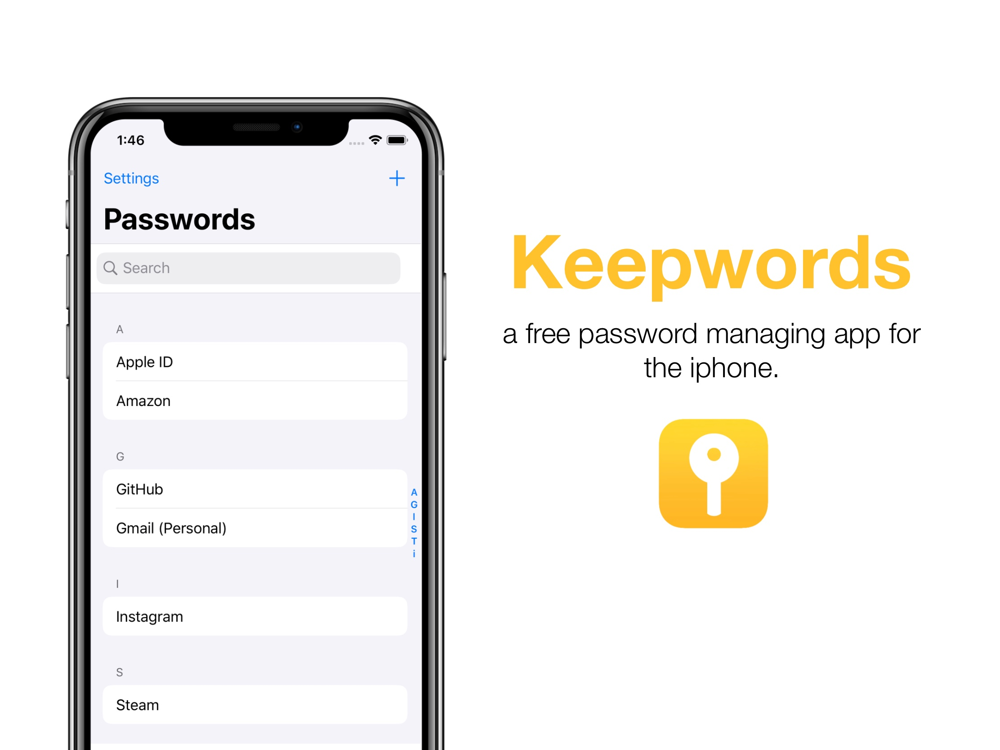

# It's called "Keepwords"
>🔐 Keepwords is a simple native iOS password app.


 
## Features
- ❌☁️ No iCloud. 

- ❌🌱 No Pods

- 👨‍💻100% local.

## Installation
No pods installation. The only thing that makes an app project too complicated is them adding **pods**. Not easy to open. In Keepwords, we don't use pods because we value the best user experience for you. 
```bash
no pods intallation = true
```

## Contributing
✅ Pull requests are welcome. For major changes, please open an issue first to discuss what you would like to change.

Please make sure to update tests as appropriate. 👌

1. Fork it (<https://github.com/jeremygautama/IOS-PasswordManager/fork>)
2. Create your feature branch (`git checkout -b feature/fooBar`)
3. Commit your changes (`git commit -am 'Add some fooBar'`)
4. Push to the branch (`git push origin feature/fooBar`)
5. Create a new Pull Request

## Support
⭐️ Your **star** means so much to us. Giving us a **star** helps us to make more epic projects that you'll enjoy!

📢 Help spread the word!!!

## License
✔️ The best license. [MIT](https://github.com/jeremygautama/ios-password-app/blob/master/LICENSE.md) License.

👤 For more information feel free to contact me through my email - jgautama7@gmail.com
